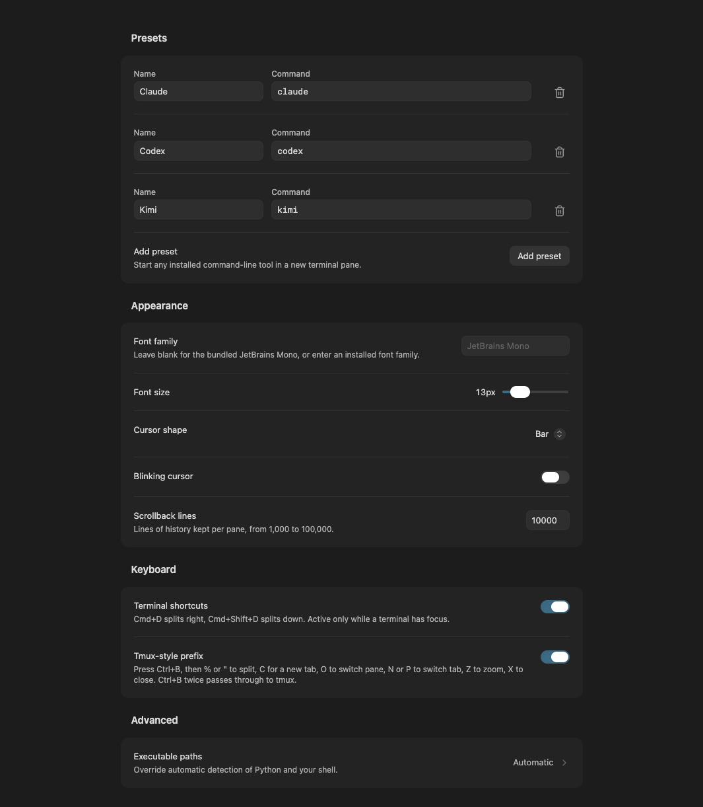

<h1 align="center">Sidebar Terminal</h1>

<p align="center"><sub>for <a href="https://obsidian.md">Obsidian</a></sub></p>

<p align="center">
  A terminal beside your notes, with native tabs, resizable splits and your own shell.
</p>

<p align="center">
  <a href="#install">Install</a> ·
  <a href="docs/usage.md">Usage</a> ·
  <a href="docs/usage.md#keyboard-shortcuts">Shortcuts</a> ·
  <a href="docs/development.md">Development</a>
</p>

<br>

Sidebar Terminal opens real shell sessions inside Obsidian's own tabs, in the sidebar or next to a note. Each pane has its own terminal buffer and process. Run your usual command-line tools there, including Claude Code, Codex or anything else you have installed.

## Features

- **Native tabs and splits.** Open several terminals as Obsidian tabs and split them right or down. Switching tabs keeps their jobs running.
- **Your shell.** Starts your configured interactive shell with its prompt, aliases and startup files.
- **Presets.** Launch an installed CLI in a new tab. When it exits, you are back in the same shell.
- **Familiar keys.** `Ctrl C` copies when text is selected and interrupts the program otherwise. Terminal shortcuts and an optional tmux-style prefix are listed in the [shortcut reference](docs/usage.md#keyboard-shortcuts).
- **Theme-aware.** Background, text and selection follow your Obsidian theme. Explicit RGB colors from TUI programs are shown unchanged.

Rendering uses xterm.js with bundled JetBrains Mono.

<details>
<summary>Settings screenshot</summary>
<br>



</details>

## Requirements

- Obsidian 1.13.1 or later, desktop only
- Python 3
- Windows 10/11 only: `pywinpty>=3.0,<4` installed for that Python

```powershell
py -3 -m pip install "pywinpty>=3.0,<4"
```

## Install

Sidebar Terminal is not listed in the Community plugins directory yet, and release builds have not been published. For now, install from source. This needs Node.js 22 or later.

```sh
git clone https://github.com/rhynelabs/sidebar-terminal.git
cd sidebar-terminal
npm ci
npm run build
npm run install:plugin -- "/path/to/vault"
```

The installer copies `main.js`, `manifest.json` and `styles.css` to `<vault>/.obsidian/plugins/sidebar-terminal/` and keeps existing settings. Then enable **Sidebar Terminal** under **Settings → Community plugins**.

Open a terminal with the ribbon icon or the **Open terminal workspace** command. To open one next to a note, use **Open terminal in editor**.

## Good to know

- **Sessions.** Closing a pane or tab ends its shell and the processes it owns. Quitting Obsidian or reloading the plugin ends all sessions.
- **Restored layouts.** Tabs, splits, names and starting directories come back after a restart. Each pane waits for you to press Start; nothing is replayed automatically.
- **Working directories.** New splits open in the pane's configured starting directory, not wherever you last moved with `cd`.
- **System access.** Shells, their configuration and the files your programs touch can live outside the vault. Programs run with your normal user permissions.
- **Privacy.** The plugin has no network service, telemetry or accounts of its own, and downloads nothing. External CLIs such as Claude Code or Codex have their own accounts, network access and billing.

More detail on presets, appearance, executable paths and sessions is in [docs/usage.md](docs/usage.md).

## Status

This is an early release (0.1.0). It has been tested live in Obsidian on macOS. Windows and Linux adapters are included, but hands-on checks in Obsidian on those platforms are still pending, automated platform checks run on GitHub.

Issues and pull requests are welcome. See the [development guide](docs/development.md), [architecture notes](docs/architecture.md), [release checklist](docs/releasing.md) and [changelog](CHANGELOG.md).

## License

Copyright © 2026 Rhynelabs. Released under the [MIT License](LICENSE).

Bundled xterm.js packages keep their MIT notices and JetBrains Mono keeps its SIL Open Font License. See [third-party notices](THIRD-PARTY-NOTICES.txt). pywinpty is installed separately and is MIT licensed.

Sidebar Terminal is an independent project and is not affiliated with or endorsed by Obsidian.
